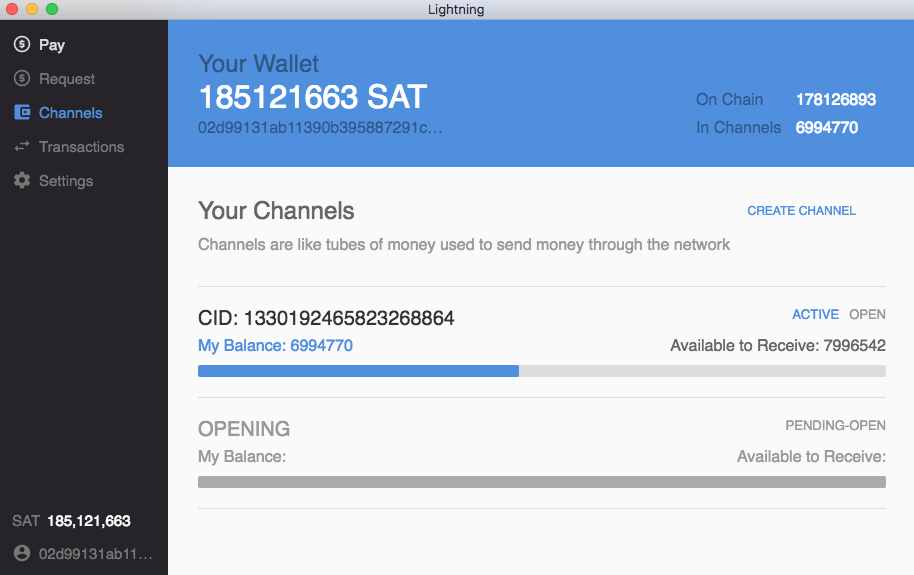

## Lightning Desktop App

This repo houses a cross-platform Lightning desktop app powered by
[`lnd`](https://github.com/lightningnetwork/lnd/). The application is under
active development and currently only operates on the Bitcoin testnet chain.



### Developing Locally


First start by pulling down the git repo:
```
git clone https://github.com/lightninglabs/lightning-app.git
```

Then go inside the project folder and run npm install (grab a coffee, this might take a while):
```
cd lightning-app
npm run setup
```

After everything has installed you can run the app in dev mode:
```
npm start
```

### Errors

If you get any errors related to GRPC on startup, run:
```
npm run setup
```

If the window doesn't load after running `npm start`: try clicking on dev tools window and hitting `cmd-r` to refresh the window.

### Logs
Logs are written to the following locations:

* **Linux:** `~/.config/Lightning/log.log`
* **OSX:** `~/Library/Logs/Lightning/log.log`
* **Windows:** `%USERPROFILE%\AppData\Roaming\Lightning\log.log`

### Building

To build binaries for OSX:
```
cd $GOPATH/src/github.com/lightningnetwork/lnd
git pull
glide install
go install . ./cmd/...
```

To build binaries for Windows:
```
cd $GOPATH/src/github.com/lightningnetwork/lnd
git pull
glide install
GOOS=windows GOARCH=amd64 go build -v
```

### Packaging
To package the app for all platforms run `npm run package-all-electron`. Make sure you have xquartz `brew cask install xquartz` wine installed `brew install wine`. If you run into `ENFILE: file table overflow` as an error put `ulimit -n 2560` in your bash profile.

Also Check: https://github.com/karma-runner/karma/issues/1979#issuecomment-217994084

To debug a packaged app, go to localhost:9997 in your browser.
